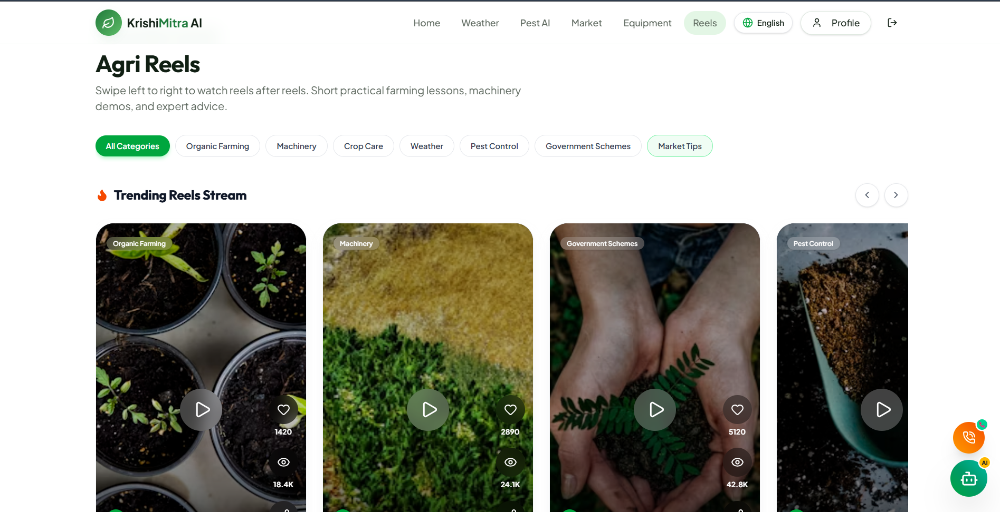
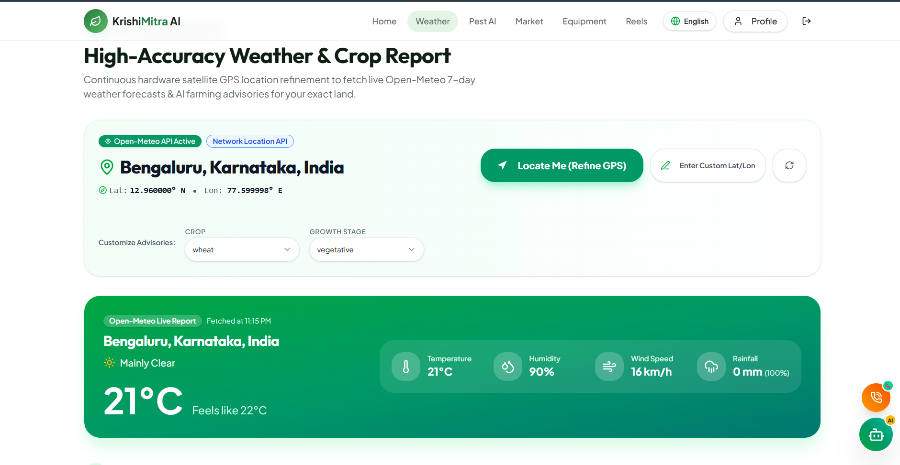
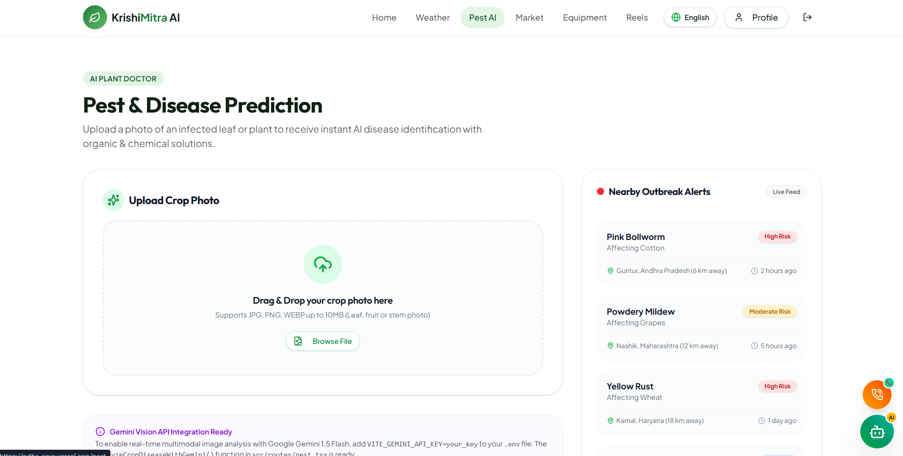
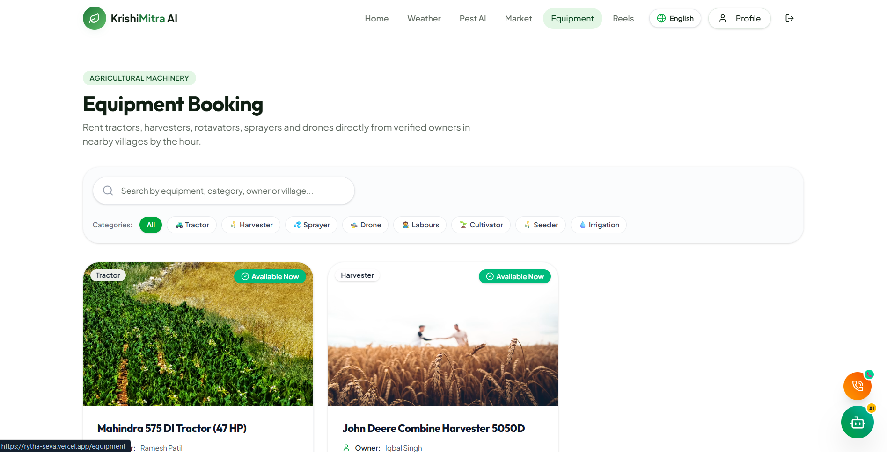
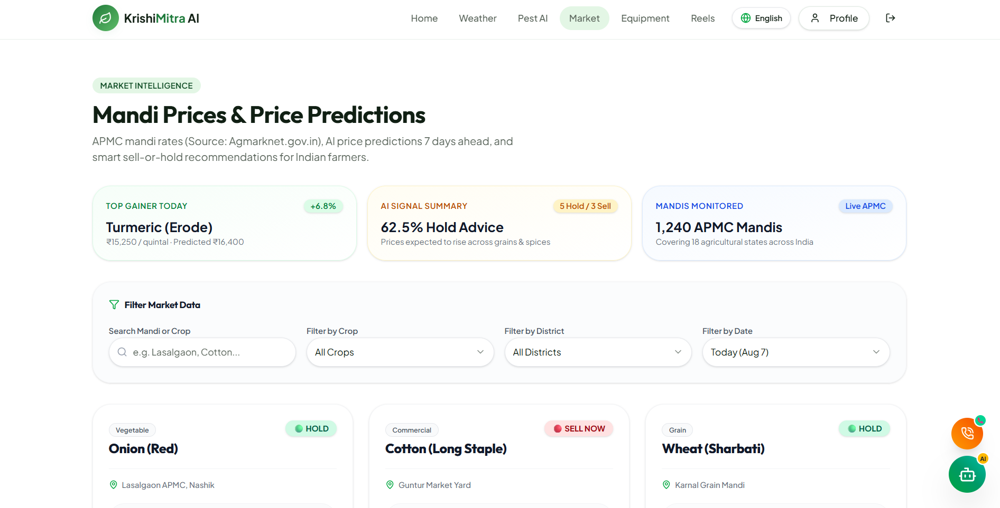
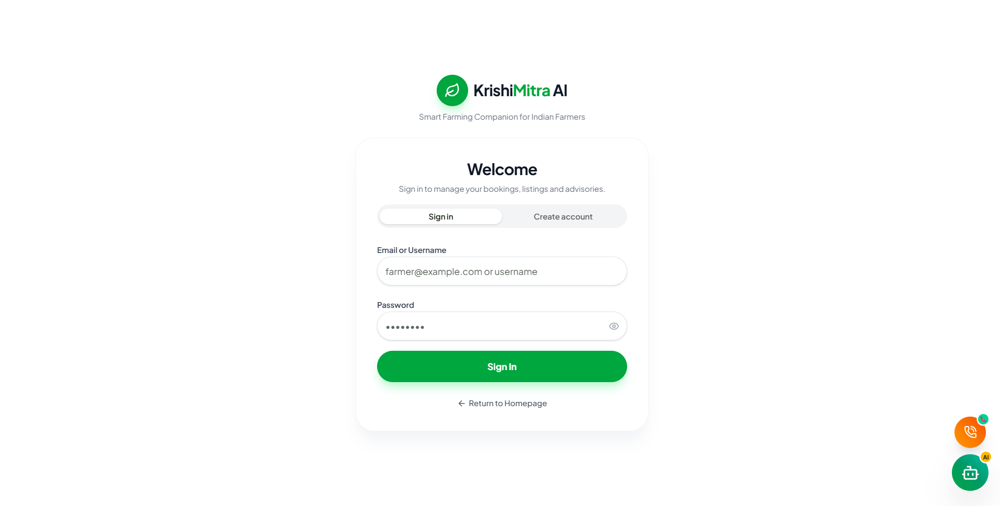
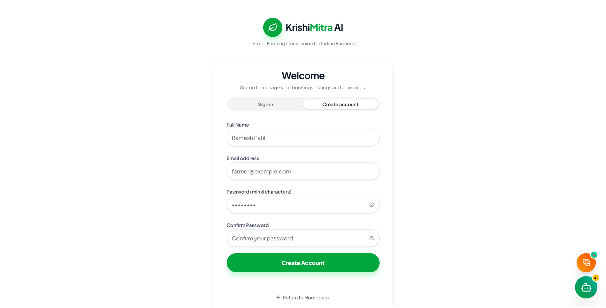
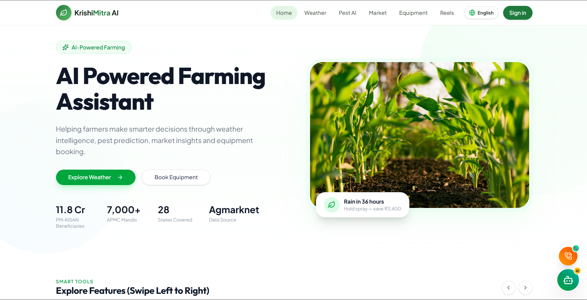
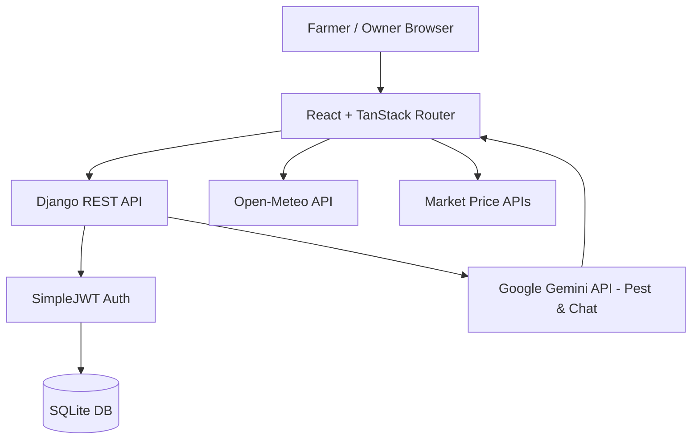

<div align="center">


# 🌾 KrishiMitra AI

### A modern agricultural intelligence platform — hyperlocal weather, pest AI, live markets, and equipment rentals in one place.

<br/>

[](https://rytha-seva.vercel.app)
[](https://github.com/Nishanth2434/Rytha-seva/stargazers)
[](LICENSE)

[](https://react.dev)
[](https://typescriptlang.org)
[](https://tailwindcss.com)
[](https://www.djangoproject.com)
[](https://sqlite.org)

</div>

---

## 🌐 Live Demo

<div align="center">

### Try the live website here 👇

<a href="https://rytha-seva.vercel.app">
  
</a>

<br/><br/>

| Area                   | URL                                                  |
| :--------------------- | :--------------------------------------------------- |
| 👨‍🌾 Farmer portal     | https://rytha-seva.vercel.app                        |
| 🚜 Owner Dashboard     | https://rytha-seva.vercel.app/owner/dashboard        |
| 🔐 Login / Register    | https://rytha-seva.vercel.app/login                  |

</div>

---

## 📸 A Look Inside — Website Trailer

<div align="center">

<b>🏠 Home — Weather forecasts, quick actions, and market insights</b>



</div>

<table>
  <tr>
    <td width="50%"><b>🌦️ Weather Advisor</b><br/></td>
    <td width="50%"><b>🐛 Pest AI Detection</b><br/></td>
  </tr>
  <tr>
    <td width="50%"><b>🚜 Equipment Rentals</b><br/></td>
    <td width="50%"><b>💰 Market Analysis</b><br/></td>
  </tr>
  <tr>
    <td width="50%"><b>🔐 Sign In</b><br/></td>
    <td width="50%"><b>📝 Sign Up</b><br/></td>
  </tr>
</table>

<div align="center">

<b>👨‍🌾 Owner Dashboard — Manage your fleet, approve listings, and track rentals</b>



</div>

<div align="center">

🔒 The owner dashboard, equipment booking system, and AI diagnostic history live behind login —
<a href="https://rytha-seva.vercel.app"><b>sign in on the live site</b></a> to see them in action.

</div>

---

## ✨ Features

<table>
  <tr>
    <td width="33%">
      <h3>🌦️ Weather Advisor</h3>
      Hyperlocal 7-day forecasts automatically converted into actionable spray and irrigation recommendations.
    </td>
    <td width="33%">
      <h3>🐛 Pest AI</h3>
      Upload crop photos for Gemini-powered disease detection with confidence scores and treatment suggestions.
    </td>
    <td width="33%">
      <h3>💰 Market Analysis</h3>
      Live mandi (market) prices powered by AI-driven sell-or-hold recommendations to maximize profits.
    </td>
  </tr>
  <tr>
    <td>
      <h3>🚜 Equipment Rentals</h3>
      A marketplace to rent tractors, harvesters, and drones from verified owners with a booking workflow.
    </td>
    <td>
      <h3>📱 Krishi Shorts</h3>
      A TikTok-style short-form video content feed dedicated exclusively to farming tips and education.
    </td>
    <td>
      <h3>🤖 AI Chatbot</h3>
      Conversational agricultural assistant powered by Google Gemini to answer complex farming queries instantly.
    </td>
  </tr>
  <tr>
    <td>
      <h3>👨‍🌾 Owner Dashboard</h3>
      Dedicated portal for equipment owners to manage their fleet, approve listings, and track rental bookings.
    </td>
    <td>
      <h3>🌐 Multilingual</h3>
      Seamlessly toggle between English, Kannada (ಕನ್ನಡ), and Hindi (हिन्दी) for complete accessibility.
    </td>
    <td>
      <h3>🔐 Secure Authentication</h3>
      Robust JWT-based authentication using Django REST Framework with secure user sessions.
    </td>
  </tr>
</table>

<details>
<summary><b>🤖 Smart extras</b></summary>

- **AI-Powered Diagnostics** — Gemini 1.5 Flash Vision analyzes plant images to provide organic and chemical treatments.
- **Multilingual Content Fallbacks** — AI translates advice and weather warnings into the user's selected language instantly.
- **Owner Verification** — Trust system where equipment owners are verified before their listings go live on the marketplace.
- **Location Auto-detect** — Automatically fetches the user's nearest village weather data without needing manual postal code entry.
- **Offline-ready caching** — Weather and Market data are aggressively cached to save bandwidth for rural users with poor connectivity.

</details>

---

## 🧰 Tech Stack

| Layer               | Technology                                                |
| :------------------ | :-------------------------------------------------------- |
| **Frontend**        | React 19 + TanStack Start (SSR) + TanStack Router         |
| **Backend**         | Python 3.10+ with Django 4.2+ & Django REST Framework     |
| **Database**        | SQLite (Development)                                      |
| **Authentication**  | Managed auth — email/password, SimpleJWT                  |
| **Hosting (Web)**   | Vercel (Edge deployment + CDN)                            |
| **UI Framework**    | Tailwind CSS v4 + shadcn/ui + Radix primitives            |
| **Icons**           | Lucide React                                              |
| **Data Fetching**   | TanStack Query                                            |
| **AI Integration**  | Google Gemini API (Vision & Text models)                  |
| **External APIs**   | Open-Meteo (Weather Data)                                 |

---

## 🏗️ Architecture

The application is built on a decoupled full-stack architecture. The React frontend interacts with the Django REST API backend, utilizing JWTs for secure access. AI processing is handed off to the Gemini API, while external agricultural data is pulled from Open-Meteo.

```text
Frontend (React + TanStack Router)
        ↓
Backend API (Django REST Framework)
        ↓
Authentication (SimpleJWT + Session Roles)
        ↓
Database (SQLite / PostgreSQL in prod)
        ↓
AI Inference (Google Gemini Vision & Text)
```



---

## 📁 Project Structure

```text
rytha-seva/
├── backend/                   # Django REST Framework Backend
│   ├── accounts/              # User models, profiles, and auth logic
│   ├── api/                   # Core application endpoints (equipment, weather, pests)
│   ├── config/                # Django project settings and root routing
│   ├── manage.py              # Django execution script
│   └── requirements.txt       # Python dependencies
│
├── src/                       # React Frontend
│   ├── assets/                # Logos and local images
│   ├── components/            # Reusable UI (shadcn, forms, navigation)
│   ├── hooks/                 # Custom React hooks (auth, geolocation)
│   ├── lib/                   # Utility functions and API client
│   ├── routes/                # TanStack Router page definitions
│   └── main.tsx               # Frontend entry point
│
├── public/                    # Static assets, favicon
├── docs/
│   └── screenshots/           # README images
├── .env.example               # Example environment variables
├── package.json               # Frontend dependencies
└── vite.config.ts             # Vite bundler configuration
```

---

## 🚀 Getting Started

To run this project locally, you will need **Node.js 18+** and **Python 3.10+**.

### 1. Clone & Install
```bash
git clone https://github.com/Nishanth2434/Rytha-seva.git
cd Rytha-seva
```

### 2. Backend Setup
```bash
# Create and activate a virtual environment
python -m venv venv
venv\Scripts\activate   # Windows
# source venv/bin/activate # macOS/Linux

# Install dependencies and setup database
pip install -r backend/requirements.txt
python backend/manage.py migrate
python backend/manage.py createsuperuser

# Start the server (runs on port 8000)
python backend/manage.py runserver 8000
```

### 3. Frontend Setup
```bash
# Open a new terminal in the project root
npm install

# Start the frontend (runs on port 5173)
npm run dev
```

### 4. Environment Variables
Create a `.env` file in the root based on `.env.example`:
```env
VITE_DJANGO_API_URL="http://localhost:8000/api"
VITE_GEMINI_API_KEY="your_gemini_api_key_here"
```

---

<div align="center">
  <b>Built with ❤️ for Indian farmers.</b>
</div>
